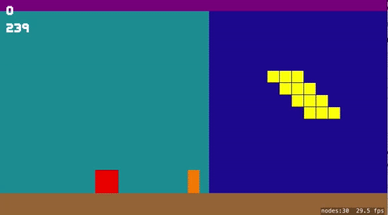
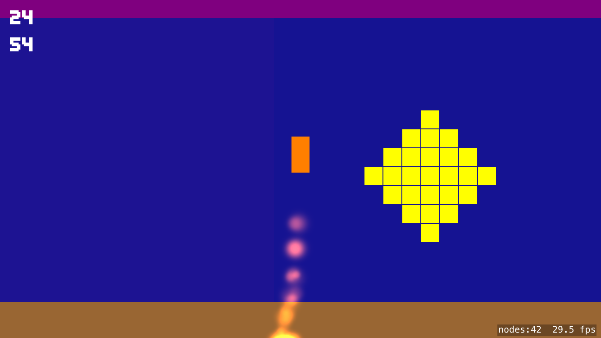

# EndlessJetpacks

This example is a proof of concept/starter projects for students wanting to create a game like 
[Jetpack Joyride](http://halfbrick.com/our-games/jetpack-joyride/), 
[Punch Quest](http://www.punchquest.com), and 
[similar games](http://appcrawlr.com/ios-apps/best-apps-similar-to-jetpack-joyride). 

This example lacks all of the power ups, acheivements, and other features that make these games great. The example presented
here shows a core mechanic that allows a player object to move forward through an ever changing landscape with various 
obstacles. 

The obstacles presented in the example come in three varieties: 
1) coins - players can pick these up
2) enemies - these are obstacles the player can destroy by firing (tap the right side of the screen)
3) deadly - these are obstacles that must be avoided

In general the system moves the player object forward followed by a camera node. There are two landscape sections that
populated with randomly selected content. As a landscape section moves out of view of the camera off the left side of the 
screen it is moved to the right of the other landscape section and it's content is replaced. 

At the moment a tap on the left turns on the "jetpack" launching the player. A tap on the right fires a missile from 
the character's location. Blue "enemy" blocks are destroyed by missiles. Red and Blue blocks might destroy the player, 
currently the game detects contact but only prints a message. 

